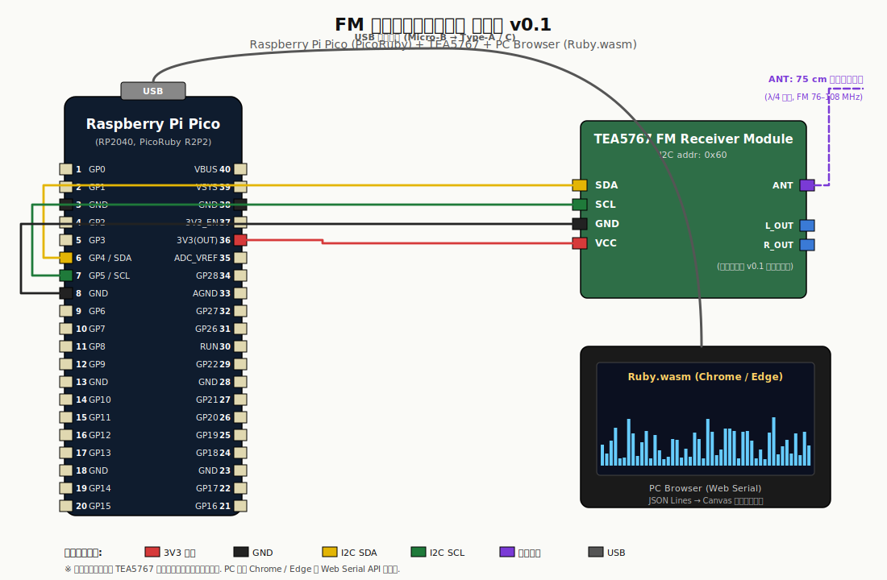
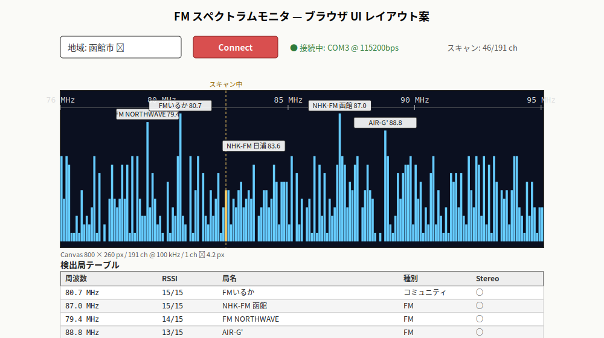

# FM スペクトラムモニタ 設計と計画 v0.1

## 📋 要約

PicoRuby を載せた Raspberry Pi Pico と TEA5767 FM 受信モジュールを使用する．
FM 放送帯（76–95 MHz）を 100 kHz 刻みで掃引し，
RSSI を USB CDC 経由でブラウザに送ってスペクトラム表示するモニタを作る．
表示側は Ruby.wasm（Ruby 4.0 系）で実装し，
PicoRuby と Ruby.wasm の両端を Ruby で通した構成を目指す．
v0.1 は函館市での RubyKaigi デモ動作を到達点とし，
ブラウザに 191 ch のバーグラフと函館ローカル局の局名ラベルを表示する．

## 📑 目次

- プロジェクトの目的とスコープ
- システム全体像
- ハードウェア設計
- 回路図
- ソフトウェア設計
- 通信プロトコル
- 局プリセット
- 開発環境のセットアップ
- 実装マイルストーン
- テスト戦略
- リスクと対策
- 法規面での注意
- 参考資料

## 🎯 プロジェクトの目的とスコープ

函館で実際に受信できる FM 局を可視化するモニタを作る．
市販ラジオでは局の強弱を把握しにくい．
RSSI（電波強度指標）をブラウザのバーグラフで描くことで，
活発な帯域と空いている帯域を一目で判別できるようにする．

本プロジェクトにはもう 1 つの目的として，
PicoRuby（組み込み側）と Ruby.wasm（ブラウザ側）の両端を
Ruby で実装することを置く．
RubyKaigi での披露を念頭に置く．電波を受け取る Pico 側と
可視化するブラウザ側を，いずれも Ruby で書き切る．
これにより Ruby がマイコンとブラウザの両端でつながる題材として成立させる．

スコープ外の項目は次のとおりとする．

- 音声再生は行わない．モニタ専用である
- 局情報の RDS 復号はしない．TEA5767 が非対応であり，日本の FM 放送でも RDS が運用されていないため
- 電池駆動や筐体化は v0.1 では扱わない．USB 給電で動作させる
- スタンドアロン動作はしない．表示と操作は PC ブラウザ側で行う

## 🧭 システム全体像

構成要素は以下のとおりである．

表 1: システム構成要素の一覧

| 要素 | 役割 | 接続 |
|---|---|---|
| Raspberry Pi Pico | PicoRuby 実行主体．TEA5767 制御とシリアル出力 | USB で PC に接続 |
| TEA5767 モジュール | FM 受信と RSSI 取得 | I2C アドレス 0x60 |
| ワイヤアンテナ 75 cm | 受信アンテナ | TEA5767 ANT |
| PC（ブラウザ） | Ruby.wasm で Web Serial から JSON Lines を受け取り Canvas に描画 | USB CDC シリアル |

Pico は USB CDC（仮想シリアル）を通じて JSON Lines を書き出し，
ブラウザの Web Serial API がこれを受け取る．
TEA5767 のプルアップ抵抗はモジュール内蔵を前提にする．

## 🔌 ハードウェア設計

### 部品リスト

表 2: BOM（v0.1）

| 品名 | 型番・備考 | 数量 |
|---|---|---|
| マイコン | Raspberry Pi Pico（RP2040） | 1 |
| FM 受信モジュール | TEA5767（手持ち在庫から 1 個） | 1 |
| ブレッドボード | ハーフサイズ以上 | 1 |
| ジャンパワイヤ | オス−オス | 適量 |
| アンテナ用ワイヤ | 75 cm（λ/4 相当） | 1 |
| USB ケーブル | Micro-B（Pico と PC を接続） | 1 |
| PC | Chrome または Edge が動作すること | 1 |

TEA5767 は 4 個の手持ちのうち 1 個を使う．
残り 3 個は将来のプリセット切替機やマルチ受信機での再利用を見込む．

### ピンアサイン

表 3: Pico 側のピン割り当て

| Pico ピン | GPIO / 機能 | 接続先 |
|---|---|---|
| 6 | GP4（I2C0 SDA） | TEA5767 SDA |
| 7 | GP5（I2C0 SCL） | TEA5767 SCL |
| 8 | GND | TEA5767 GND |
| 36 | 3V3(OUT) | TEA5767 VCC |

I2C のバス速度は 100 kHz を基本とする．
TEA5767 しか接続しないので 400 kHz に上げる余地はあるが，
v0.1 では速度を追求しない．

### 電源設計

Pico の 3V3(OUT) は最大 300 mA ほど供給でき，
TEA5767 モジュール（20 mA 程度）の消費には十分な余裕がある．
USB 給電のみで動作させる．

### 配線

v0.1 はブレッドボード配線とする．
TEA5767 の VCC・GND・SDA・SCL をブレッドボード上のバスに接続し，
Pico の該当ピンから 4 本のワイヤで各バスに合流させる．
TEA5767 の ANT 端子に 75 cm のワイヤを取り付ける．

## 🗺️ 回路図



図 1: FM スペクトラムモニタ配線図（SVG 版）

同等の回路を KiCad 8 形式でも用意した．
本体は `fm_spectrum_monitor.kicad_sch`．
`fm_spectrum_monitor.kicad_pro` とあわせて KiCad 8 以降で開ける．

## 💻 ソフトウェア設計

### 全体アーキテクチャ

ソフトウェアは 2 つの階層に分ける．

表 4: ソフトウェア階層の全体構成

| 階層 | ディレクトリ | 責務 | 実行環境 |
|---|---|---|---|
| firmware | `firmware/` | TEA5767 を I2C 制御し，スキャン結果を JSON Lines で USB CDC に出力 | Raspberry Pi Pico（PicoRuby） |
| web | `web/` | Web Serial で JSON Lines を受け取り，集約・ピーク検出・局名付与を行って Canvas に描画 | PC ブラウザ（Ruby.wasm + JavaScript） |

どちらも CRuby 互換の Ruby で書ける範囲に留め，
純ロジックは CRuby で minitest によってテスト可能な形にする．

### firmware 層の責務

表 5: firmware 層の内訳

| ファイル | 責務 |
|---|---|
| `firmware/lib/tea5767.rb` | TEA5767 の I2C 制御（PLL 計算・書き込み・読み出し） |
| `firmware/lib/spectrum_scanner.rb` | 191 ch のスイープ実行と RSSI 配列の管理 |
| `firmware/lib/serial_emitter.rb` | JSON Lines の組み立てと USB CDC 出力 |
| `firmware/app.rb` | 起動後のスキャンループ．R2P2 では `/home/app.rb` が自動起動ファイル |

ドライバ層は I2C オブジェクトをコンストラクタ注入で受け取る．
これにより PicoRuby 本体に載せずとも，
CRuby 側で fake I2C を差し込んだテストが可能になる．

### web 層の責務

表 6: web 層の内訳

| ファイル | 責務 | 種別 |
|---|---|---|
| `web/index.html` | ルート HTML．ruby.wasm IIFE を CDN から読み込み `<script type="text/ruby" data-eval="async" src="...">` で各 Ruby ファイルを読む | 静的 |
| `web/app.rb` | エントリポイント．モック / Serial 接続と描画ループを結線 | Ruby.wasm |
| `web/lib/serial_client.rb` | Web Serial の接続と JSON Lines の行分割 | Ruby.wasm |
| `web/lib/mock_source.rb` | 函館想定の擬似 RSSI 配列を生成 | 純ロジック |
| `web/lib/mock_stream.rb` | MockSource を使って setTimeout 再帰で tick/done を流すストリーム | Ruby.wasm |
| `web/lib/protocol.rb` | JSON Lines のパースとスキーマ検証 | 純ロジック |
| `web/lib/aggregator.rb` | 191 ch → N px の最大値集約と clear | 純ロジック |
| `web/lib/peak_detector.rb` | RSSI 配列からピーク（局候補）を抽出 | 純ロジック |
| `web/lib/station_directory.rb` | 周波数から `stations.json` のプリセットを引く | 純ロジック |
| `web/lib/canvas_renderer.rb` | Canvas への描画（軸・バー・ラベル衝突回避） | Ruby.wasm |
| `web/data/stations.json` | 地域ごとの局プリセット | データ |

純ロジック 4 本を CRuby でそのまま minitest にかけられる．
対象は `protocol.rb` / `aggregator.rb` / `peak_detector.rb` / `station_directory.rb` の 4 ファイル．
これにより Pico や実ブラウザがなくても大半のバグを潰せる．

### TEA5767 の制御

TEA5767 は 5 バイトの書き込みで設定を指定し，
5 バイトの読み出しで状態を取得する固定長プロトコルである．
同調周波数は PLL 分周比として表現され，
高側ヘテロダインを選んだ場合の計算式は次のとおりである．

```
N = 4 × (f_RF + f_IF) / f_ref
  f_IF  = 225 kHz
  f_ref = 32.768 kHz
```

82.5 MHz の場合，N は 10098 となる．
書き込み 1 バイト目の下位 6 ビットに `PLL[13:8]` を，
2 バイト目に `PLL[7:0]` を置く．
3 バイト目以降で高／低側ヘテロダイン選択，
ステレオ／モノラル，ミュート，水晶使用を指定する．

RSSI は読み出し 4 バイト目の上位 4 ビットにあり，
0〜15 の 16 階調で表現される．
スペクトラム表示には十分な分解能である．

### 書き込みバイトの構成

表 7: TEA5767 書き込みバイト

| バイト | 主要ビット | 本プロジェクトでの値 |
|---|---|---|
| 1 | MUTE, SM, PLL[13:8] | MUTE=0, SM=0, PLL 上位 |
| 2 | PLL[7:0] | PLL 下位 |
| 3 | HLSI, MS, MR, ML など | HLSI=1, MS=0（ステレオ） |
| 4 | BL, XTAL, SMUTE, HCC など | XTAL=1, SMUTE=0 |
| 5 | PLLREF, DTC | DTC=0（50 μs） |

MS=0 としてステレオ復調を許容している．
RSSI の読み出しはステレオ判定と独立した経路なので，
スキャン結果の比較そのものには影響しない．
ステレオ成立の有無は読み出しバイト 2 の STEREO ビットから得られ，
JSON Lines の `stereo` フィールドとしてブラウザへ渡す．

### スイープ方式

76.0〜95.0 MHz の 191 チャンネルを 100 kHz 刻みで掃引する．
将来の FM 補完放送を含む日本の FM 放送帯全域をカバーする範囲である．

1 チャンネルあたりの処理は次の順で行う．
PLL 書き込み，50 ms のロック待ち，状態読み出し，RSSI 取り出し，JSON Lines 1 行の送出．
191 チャンネルで合計およそ 10–11 秒となる見込みで，
ユーザー体験としては許容範囲に収まる．

### 表示設計

ブラウザ画面は 4 ブロックで構成する．

表 8: ブラウザ画面の構成ブロック

| ブロック | 役割 |
|---|---|
| 地域セレクタ | 局プリセットの地域を選択．v0.1 は「函館市」のみ |
| 「モックスキャン開始」ボタン | MockStream で擬似 tick を流して UI 全体を動作確認．Pico 非接続でも動く |
| 「Pico に接続」ボタン | Web Serial の `requestPort()` を起動して実機と接続 |
| スペクトラム Canvas | 191 ch のバーグラフ．カーソルで現在スキャン位置を表示．一致した局名ラベル |
| 検出局テーブル | ピーク検出結果（周波数・RSSI・局名） |

Canvas は横 800 px × 縦 300 px 程度を基準とする．
191 ch を横 800 px に割り当てれば 1 ch あたり約 4.2 px になり，
視認性は十分に取れる．
OLED 時代に必要だった「複数 ch を 1 px に集約する処理」は
デフォルト表示では不要になるが，
横幅が 191 px を下回る端末向けに `aggregator.rb` は残しておく．



図 2: ブラウザ UI レイアウト概念図

### コードスケルトン

実装の方向性を固めるため，最小限のスケルトンを記しておく．
実コードはテスト駆動で段階的に作り上げる．

#### firmware 側

```ruby
# firmware/lib/tea5767.rb
class TEA5767
  ADDRESS          = 0x60
  IF_FREQ_HZ       = 225_000
  XTAL_FREQ_HZ     = 32_768
  PLL_LOCK_WAIT_MS = 50

  def initialize(i2c)
    @i2c = i2c
  end

  def self.pll_for(freq_hz)
    4 * (freq_hz + IF_FREQ_HZ) / XTAL_FREQ_HZ
  end

  def tune(freq_hz)
    pll = self.class.pll_for(freq_hz)
    @i2c.write(
      ADDRESS,
      (pll >> 8) & 0x3F,
      pll & 0xFF,
      0b1011_0000,   # HLSI=1, MS=0
      0b0001_0000,   # XTAL=1
      0b0000_0000,   # DTC=0
    )
  end

  def status
    b = @i2c.read(ADDRESS, 5).bytes   # PicoRuby の i2c.read は String を返すため .bytes で配列化
    {
      ready:  (b[0] >> 7) & 1 == 1,
      stereo: (b[2] >> 7) & 1 == 1,
      rssi:   (b[3] >> 4) & 0x0F,
    }
  end
end
```

```ruby
# firmware/lib/spectrum_scanner.rb
class SpectrumScanner
  # sleeper を注入で受け取り、CRuby テストでは no-op、実機では sleep_ms を渡す
  def initialize(receiver, start_hz:, step_hz:, count:, sleeper: ->(_ms) {})
    @receiver = receiver
    @start_hz = start_hz
    @step_hz  = step_hz
    @count    = count
    @sleeper  = sleeper
  end

  def scan
    @count.times do |i|
      freq = @start_hz + @step_hz * i
      @receiver.tune(freq)
      @sleeper.call(TEA5767::PLL_LOCK_WAIT_MS)
      yield(i, freq, @receiver.status) if block_given?
    end
  end
end
```

#### web 側

```ruby
# web/lib/aggregator.rb（純ロジック）
class Aggregator
  def initialize(channel_count:, pixel_count:)
    @channel_count = channel_count
    @pixel_count   = pixel_count
    @rssi          = Array.new(channel_count, 0)
  end

  def update(channel_index, rssi)
    @rssi[channel_index] = rssi
  end

  # 連続スキャン時に前回結果を捨てるため tick i==0 で呼ぶ
  def clear
    @rssi = Array.new(@channel_count, 0)
  end

  def pixels
    Array.new(@pixel_count) do |px|
      ch_start = (px * @channel_count) / @pixel_count
      ch_end   = ((px + 1) * @channel_count) / @pixel_count
      ch_end   = ch_start + 1 if ch_end <= ch_start
      @rssi[ch_start...ch_end].max
    end
  end
end
```

他のファイルは Phase 1 以降で TDD で書き起こす．

## 🔁 通信プロトコル

Pico とブラウザは USB CDC シリアル上で JSON Lines（1 行 1 JSON）をやり取りする．
ボーレートは 115200 bps を基本とする．

表 9: メッセージ種別

| 種別 | 意味 | 例 |
|---|---|---|
| `tick` | 1 ch 分のスキャン結果 | `{"t":"tick","i":42,"f":80200000,"rssi":9,"stereo":false}` |
| `done` | 1 スキャン完了 | `{"t":"done","peak":{"i":47,"f":80700000,"rssi":15}}` |
| `error` | Pico 側で発生した例外 | `{"t":"error","msg":"i2c_timeout"}` |

フィールドは次のとおり定義する．

- `i`：チャンネル番号（0 始まり）
- `f`：周波数（Hz，整数）
- `rssi`：0〜15
- `stereo`：真偽値

ブラウザ側は行単位で JSON.parse し，`t` で分岐する．
スキーマに合わない行は無視するが，`error` は UI に表示する．

## 🗺️ 局プリセット

函館ローカルの局プリセットは [`web/data/stations.json`](../web/data/stations.json) に置く．
構造は次のとおり．

```json
{
  "regions": {
    "hakodate": {
      "name": "函館市",
      "prefecture": "北海道",
      "stations": [
        { "freq_khz": 79400, "name": "FM NORTHWAVE", "kind": "fm", "power_w": 250, "site": "函館" },
        { "freq_khz": 80700, "name": "FMいるか", "kind": "community", "power_w": 20, "site": "函館" },
        { "freq_khz": 83600, "name": "NHK-FM 日浦中継局", "kind": "fm", "power_w": 10, "site": "函館市日浦" },
        { "freq_khz": 87000, "name": "NHK-FM 函館", "kind": "fm", "power_w": 250, "site": "函館" },
        { "freq_khz": 88800, "name": "AIR-G'（FM 北海道）", "kind": "fm", "power_w": 250, "site": "函館" }
      ]
    }
  }
}
```

`station_directory.rb` は `tick.f` を kHz に換算したうえで，
地域プリセットの中から ±50 kHz 以内の局を引く．
ヒットした局名を Canvas 上のバーにラベル表示する．
HBC / STV のワイド FM は函館では運用されていないのでプリセットには含めない．

## 🔧 開発環境のセットアップ

### CRuby と minitest（純ロジックのテスト用）

- Ruby 4.0.x（RubyInstaller の Ruby+Devkit 推奨）をインストール
- minitest と rake は標準添付．追加 gem は不要
- `cd web && rake test` と `cd firmware && rake test` で純ロジックの minitest が走る

### ブラウザ側のローカル配信

Ruby.wasm は外部 `.rb` ファイルを fetch で読み込むため，`file://` で開くと CORS により失敗する．
Ruby 標準のワンライナーで簡易 HTTP サーバーを起動して `http://localhost:8000/` で開く．

```
cd web
ruby -run -e httpd -- . -p 8000
```

Web Serial API の Secure Context 要件（`http://localhost` は Secure とみなす）も同時に満たせる．

### Pico 側の PicoRuby R2P2 書き込み

本プロジェクトの firmware は [PicoRuby R2P2](https://github.com/picoruby/R2P2) 上で動作する．
Raspberry Pi Pico への PicoRuby 書き込み手順は R2P2 公式ドキュメントに従う（概略：BOOTSEL 起動中に UF2 ファイルをドラッグ＆ドロップ）．
本リポジトリの対象外とする．

### firmware の転送

PicoRuby が書き込まれた Pico に対して，本リポジトリの `firmware/app.rb` と `firmware/lib/*.rb` を R2P2 のファイルシステムに転送する．

- `firmware/app.rb` を `/home/app.rb` に配置する．R2P2 は起動時に **`/home/app.rb` を自動実行する** ．
- `firmware/lib/*.rb` を `/home/lib/` 配下に配置する．`app.rb` は `require "/home/lib/tea5767"` のように **絶対パスで読み込む** ．PicoRuby には `require_relative` が未実装のため．
- 転送方法は R2P2 のバージョンに依存するため，R2P2 のドキュメント（R2P2 シェルの `cp` コマンド，DFU 経由のアップロード等）に従う．

## 🗓️ 実装マイルストーン

Phase 方式で進める．
まず高レイヤの純ロジックをテストで固めてから，
モックデータでブラウザ描画を確認し，
最後に実機（Pico）接続に降りていく段取りとする．

表 10: マイルストーン

| 段階 | 内容 | 完了条件 |
|---|---|---|
| Phase 1 | web 純ロジックの TDD | `aggregator` / `protocol` / `peak_detector` / `station_directory` の minitest が緑 |
| Phase 2 | ブラウザ描画＋モックソース | `mock_source` で擬似 tick を流して Canvas にバーグラフと局名が描ける |
| Phase 3 | Web Serial 接続 | 実 Pico または USB CDC 相当装置から受けた JSON Lines で描画できる |
| Phase 4 | firmware 実装 | Pico 実機で 191 ch スイープと JSON Lines 出力が成立 |
| Phase 5 | 函館での実測 | RubyKaigi 会場で既知局と可視化結果が一致 |

各段階で GitHub 上の Issue として切り出し，
Draft PR を作って Red-Green-Refactor を回す．
コミット粒度は 1 サイクル 1 コミットを目安にする．

## 🧪 テスト戦略

TDD サイクルを徹底し，まず CRuby 側で回る純ロジックテストを書く．
PicoRuby と Ruby.wasm はいずれも CRuby 互換サブセットなので，
I/O 境界を抽象化すればロジック部分は CRuby でテスト可能である．
テストフレームワークは minitest を使う（Ruby 標準添付で追加 gem が不要）．

表 11: 各層のテスト方針

| 層 | テスト対象 | 手段 |
|---|---|---|
| firmware ドライバ | PLL 計算，バイト列生成，読み出しパース | フェイク I2C で write 検証 |
| firmware ドメイン | スイープ順，結果配列，境界条件 | フェイク受信機でシミュレート |
| web 純ロジック | JSON Lines パース，集約，ピーク検出，局プリセット引き | minitest |
| web 描画 | Canvas 描画 | ブラウザで手動確認．モックソースで擬似 tick を流す |
| web シリアル | Web Serial 接続 | 実機 Pico または同等の USB CDC 装置で検証 |

### テストケース例

`aggregator.rb` の最初のテストは以下のような形から始める．

```ruby
# web/spec/aggregator_test.rb 相当
require "minitest/autorun"
require_relative "../lib/aggregator"

class AggregatorTest < Minitest::Test
  def test_ピクセル数がチャンネル数と等しいときは恒等集約
    agg = Aggregator.new(channel_count: 4, pixel_count: 4)
    [3, 7, 11, 15].each_with_index { |r, i| agg.update(i, r) }
    assert_equal [3, 7, 11, 15], agg.pixels
  end

  def test_チャンネル数がピクセル数を上回るときは複数chの最大値になる
    agg = Aggregator.new(channel_count: 191, pixel_count: 128)
    agg.update(0, 15)
    agg.update(1, 7)
    assert_equal 15, agg.pixels.first
  end
end
```

同様に，`TEA5767` ドライバには PLL 計算の単体テストを用意する．

```ruby
class TEA5767Test < Minitest::Test
  def test_pll_for_82_5MHz
    assert_equal 10098, TEA5767.pll_for(82_500_000)
  end

  def test_pll_for_76_0MHz
    assert_equal 9304, TEA5767.pll_for(76_000_000)
  end
end
```

## ⚠️ リスクと対策

表 12: リスクと対策の対応表

| リスク | 影響 | 対策 |
|---|---|---|
| TEA5767 個体差でロック時間が変動 | スキャン値が不安定 | ロック完了フラグをポーリング |
| I2C プルアップ抵抗が未実装 | 通信失敗 | モジュール実装を実機確認．必要なら 4.7 kΩ を追加 |
| アンテナ不足で全局弱い | 比較の意味が薄れる | 75 cm ワイヤを伸ばして垂直保持 |
| Web Serial 非対応ブラウザ | デモ実行不能 | Chrome / Edge を明示．当日は事前に動作確認 |
| Ruby.wasm の初期ロード遅延 | 起動 3–5 秒の待ち | ローディング画面で進行を示す．会場 Wi-Fi が弱いならローカル起動に切替 |
| Ruby 4.0 系 wasm の安定性 | ブラウザ側で予期せぬ失敗 | 3.4 安定版に退避できるよう `<script src=...>` を 1 行で差し替えられる構成にする |
| Pico の USB CDC 出力ドロップ | JSON Lines 欠損 | ブラウザ側でシーケンス番号 `i` を見て欠損を検出し UI に警告 |

## ⚖️ 法規面での注意

本プロジェクトは受信のみを行う．
TEA5767 は受信 IC であり送信機能を持たないため，
電波法上の免許や微弱電波規制の対象にはならない．
アンテナを屋外に延長する場合のみ避雷対策を別途検討する．

将来 NS73M や NJM2035 を送信側として組み合わせる場合は，
微弱電波の基準（3 m で 500 μV/m 以下）に収めるか，
適合表示のある完成品を使う前提で別途計画を立てる．

v0.1 は受信のみのため上記後半（送信側）は実装対象外だが，
本実装計画を順当に進めると v0.2 以降で送信側の実験が視野に入る．
そのタイミングで改めて参照できるようにここに書き残しておく．

## 📚 参考資料

- PicoRuby 公式ドキュメント：https://picoruby.github.io/
- PicoRuby IO Peripheral（I2C 他）：https://picoruby.org/
- TEA5767 データシート（NXP）：https://www.voti.nl/docs/TEA5767.pdf
- Raspberry Pi Pico データシート：https://datasheets.raspberrypi.com/pico/pico-datasheet.pdf
- ruby.wasm（GitHub）：https://github.com/ruby/ruby.wasm
- Web Serial API 仕様（WICG）：https://wicg.github.io/serial/
- 函館地方の FM ラジオ周波数ガイド（denpa-data）：https://www.denpa-data.com/i/fm/hokkaido/hakodate.htm
- 総務省 全国民放 FM 局・ワイド FM 局一覧：https://www.soumu.go.jp/menu_seisaku/ictseisaku/housou_suishin/fm-list.html

